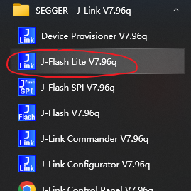
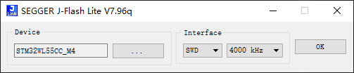
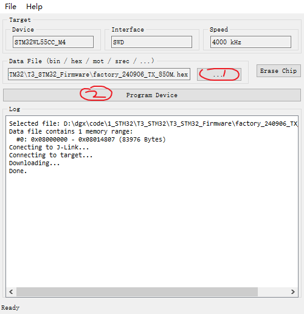
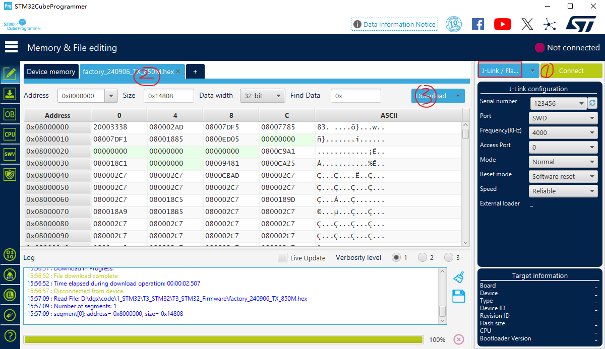

<h1 align = "center">🏆 T3-STM32 🏆</h1>

# project

The STM32WL55CCU6 long-range wireless and ultra-low-power devices embed a powerful and ultra-low-power LPWAN-compliant radio solution, enabling the following modulations: LoRa®, (G)FSK, (G)MSK, and BPSK.

STM32WL55CCU6 256-Kbyte flash memory, 64-Kbyte SRAM

# examples

For more information about the examples, see the README.md file in the examples directory.

Note that when using `UART` to view the log, the baud rate is `9600`.

Refer to the STM32CubeMX resource pack for more example. It is usually under path `C:\Users\user\STM32Cube\Repository\STM32Cube_FW_WL_V1.x.0\Projects`

~~~
├─1_led : Create simple projects
├─2_jlink_rtt_print : Used only to test jlink printing
├─3_sdcard : Test TF card screen
├─4_oled : Test oled screen
├─5_RF_test : This example is AT Slave and is only used for RF testing
├─6_SubGHz_TXRX : Transceiver test using Lora modulation
├─DeepSleep : Test board sleep power consumption
├─PingPong : Port CubeMX package SubGHz_Phy_PingPong program
~~~

# firmware

The factory firmware in `T3_STM32_Firmware\xxx.hex` is generated using `examples\6_SubGHz_TXRX`, the only difference between them is transceiver and frequency.

Other firmware can be downloaded at `examples\[project]\MDK-ARM\[project]\[project].hex`

# download

There are many ways to download the program, `jlink`, `stlink`, `UART`;

Note that before using `jlink` or `stlink` to download the program, you should install the corresponding driver.

ST official programming software download [STM32CubeProgrammer download](https://www.st.com.cn/zh/development-tools/stm32cubeprog.html)

## jlink download

1. [Installing jlink driver](https://www.segger.com/downloads/jlink/), Then connect jlink to the board.

2. After installing jlink, open `J-Flash Lite` to download the firmware.

3. Select the following configuration.

4. Click (1) to load the firmware and click (2) to download the firmware.

If you use STM32CubeProgrammer, you can:
- 1、Select jlink and click `Connect`
- 2、Select the firmware you want to download
- 3、Click the `Download` button to download

## stlink download

TODO...

## UART download

TODO...