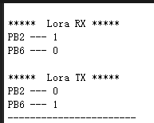
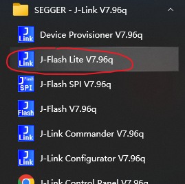
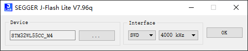
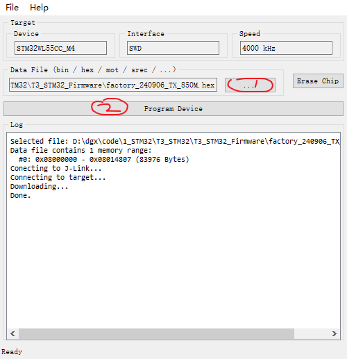
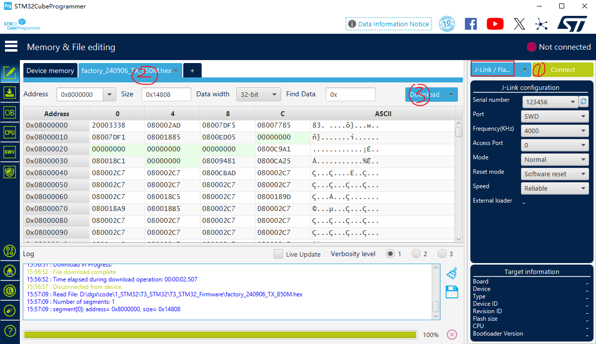
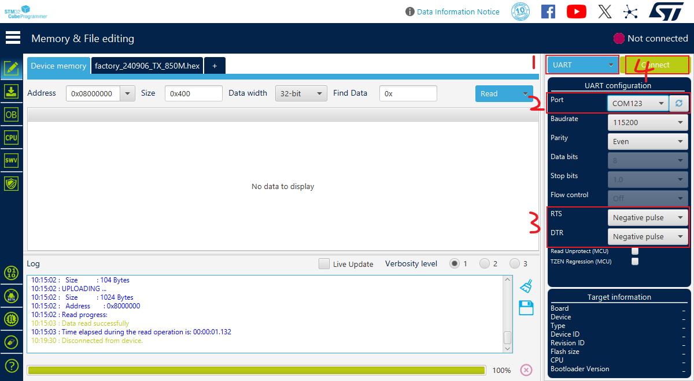
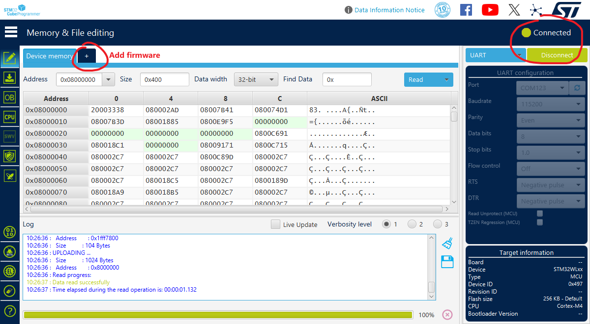

<h1 align = "center">🏆 T3-STM32 🏆</h1>

**[English](README.md) | 中文**

# 项目简介

STM32WL55CCU6 是一款支持远距离无线通信和超低功耗的器件，内置功能强大的 LPWAN 兼容无线模块，支持以下调制方式：LoRa®、(G)FSK、(G)MSK 和 BPSK。

- 频率范围：150 MHz 至 960 MHz
- 调制：LoRa®、（G）FSK、（G）MSK 和BPSK
- 接收灵敏度：2-FSK可达–123 dBm（在1.2 Kbit/s时），LoRa®的-148 dBm（在10.4 kHz，展频因子12）
- 发射机高输出功率，可编程最高可达 +22 dBm
- 发射机 低输出功率，可编程最高可达 +15 dBm
- 可选集成无源器件（IPD）配套芯片用于优化匹配，过滤和平衡，三者合而为一，非常紧凑涵盖每个封装和主方案的解决方案使用场景（22dBm @ 915 MHz，14 dBm @ 868 MHz，17 dBm @ 490 MHz）

STM32WL55CCU6 具有 256KB Flash 和 64KB SRAM。

## `T3-STM32` 注意事项：
- 接收模式下，`PB2` 引脚为`高`电平，`PB6` 引脚为`低`电平。
- 发送模式下，`PB2` 引脚为`低`电平，`PB6` 引脚为`高`电平。

# 示例程序

更多示例信息请参阅 examples 目录下的 README.md 文件。

使用 `UART` 查看日志时，波特率为 `9600`。

更多示例可参考 STM32CubeMX 资源包，通常位于路径 `C:\Users\user\STM32Cube\Repository\STM32Cube_FW_WL_V1.x.0\Projects`

~~~
├─1_led : 创建简单项目
├─2_jlink_rtt_print : 仅用于测试 jlink 打印
├─3_sdcard : 测试 TF 卡读写
├─4_oled : 测试 OLED 屏幕
├─5_RF_test : AT 从机示例，仅用于射频测试
├─6_SubGHz_TXRX : 使用 LoRa 调制进行收发测试
├─DeepSleep : 测试板子睡眠功耗
├─PingPong : 移植 CubeMX 包中的 SubGHz_Phy_PingPong 程序
├─Ra-08：通过串口 AT 指令控制 Ra-08（ASR6601）模块进行 LoRa 无线通信
~~~

# 固件

`T3_STM32_Firmware\xxx.hex` 中的出厂固件由 `examples\6_SubGHz_TXRX` 生成，区别仅在于收发模式和频率不同。

其他固件可在 `examples\[project]\MDK-ARM\[project]\[project].hex` 下载。

# 下载方式

程序下载方式有多种：`jlink`、`stlink`、`UART`。

使用 `jlink` 或 `stlink` 下载前，需先安装对应驱动。

ST 官方编程软件下载：[STM32CubeProgrammer 下载](https://www.st.com.cn/zh/development-tools/stm32cubeprog.html)

## jlink 下载

1. [安装 jlink 驱动](https://www.segger.com/downloads/jlink/)，然后将 jlink 连接到开发板。

2. 安装完成后，打开 `J-Flash Lite` 进行固件下载。

3. 按下图进行配置。

4. 点击 (1) 加载固件，点击 (2) 下载固件。

如使用 STM32CubeProgrammer，步骤如下：
- 1、选择 jlink 并点击 `Connect`
- 2、选择要下载的固件
- 3、点击 `Download` 按钮进行下载

## UART 下载

将设备插入电源并进入下载模式。

按住 `boot` 键，再按 `rst` 键；最后先松开 `rst` 键，再松开 `boot` 键。

1. 选择 UART 下载模式
2. 选择正确的串口
3. RTS/DTR 选择负脉冲模式
4. 最后点击 Connect

连接成功后，点击 `+` 号添加要下载的固件。

## STlink 下载

