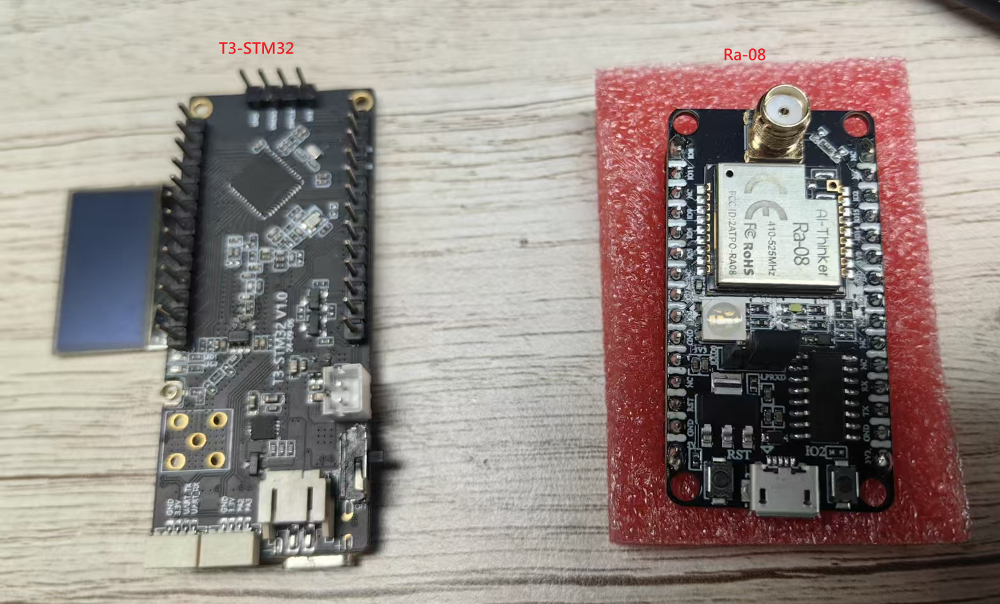
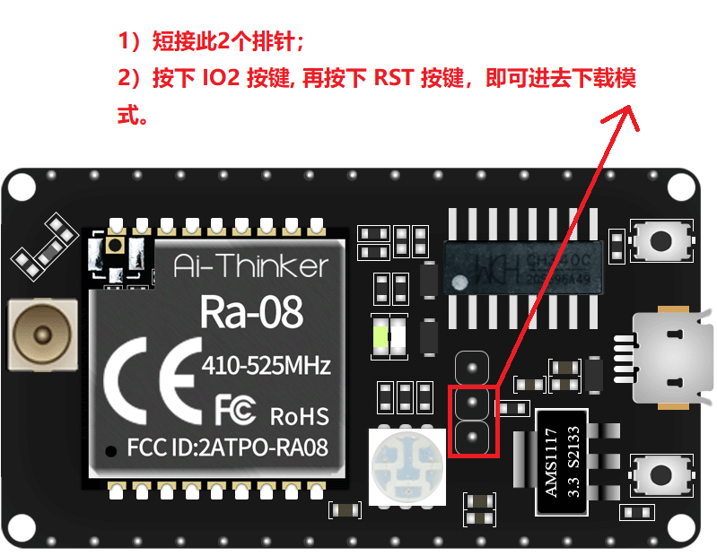

# Ra-08 LoRa Communication Example

[中文](README_CN.md) | **English**

Based on the Q443-T3-STM32 board, controls the Ra-08 (ASR6601) LoRa module via serial AT commands.

Reference:
- ai-thinker: https://docs.ai-thinker.com/Ra-08/
- AT command reference: [AT Commands](./AT_Commands.md)

## Quick Start

Connect the board via serial (baud rate 9600). On power-up, the console prints the available commands. Type AT commands directly to operate.

### Two-board Communication Example

Test devices:


#### LilyGo-T3 Setup (Transmitter)

- Flash the [examples/Ra-08](https://github.com/Xinyuan-LilyGO/T3-STM32/tree/master/examples/Ra-08/MDK-ARM/Ra-08) firmware
- Send the following AT commands via serial (baud rate 9600):

```
AT+CTXADDRSET=12        # target address = 12 (receiver's local address)
AT+CADDRSET=13          # local address = 13
AT+CTX=920800000,7,2,2,22,0
```

After entering transparent transmission mode (prompt `>`), serial input is sent directly. Type `+++\r\n` to exit.

#### Ra-08 Setup (Receiver)

- Flash the [ra-08_lora_transparent_at_20221118_lpuart_addr](https://aithinker-static.oss-cn-shenzhen.aliyuncs.com/docs/_media_old/ra-08_lora_transparent_at_20221118_lpuart_addr.zip) firmware
  
- Send the following AT commands via serial (baud rate 9600):

```
AT+CADDRSET=12          # local address = 12 (matches transmitter's target address)
AT+CRXS=920800000,7,2,2,0
```

Received data is printed as a string.